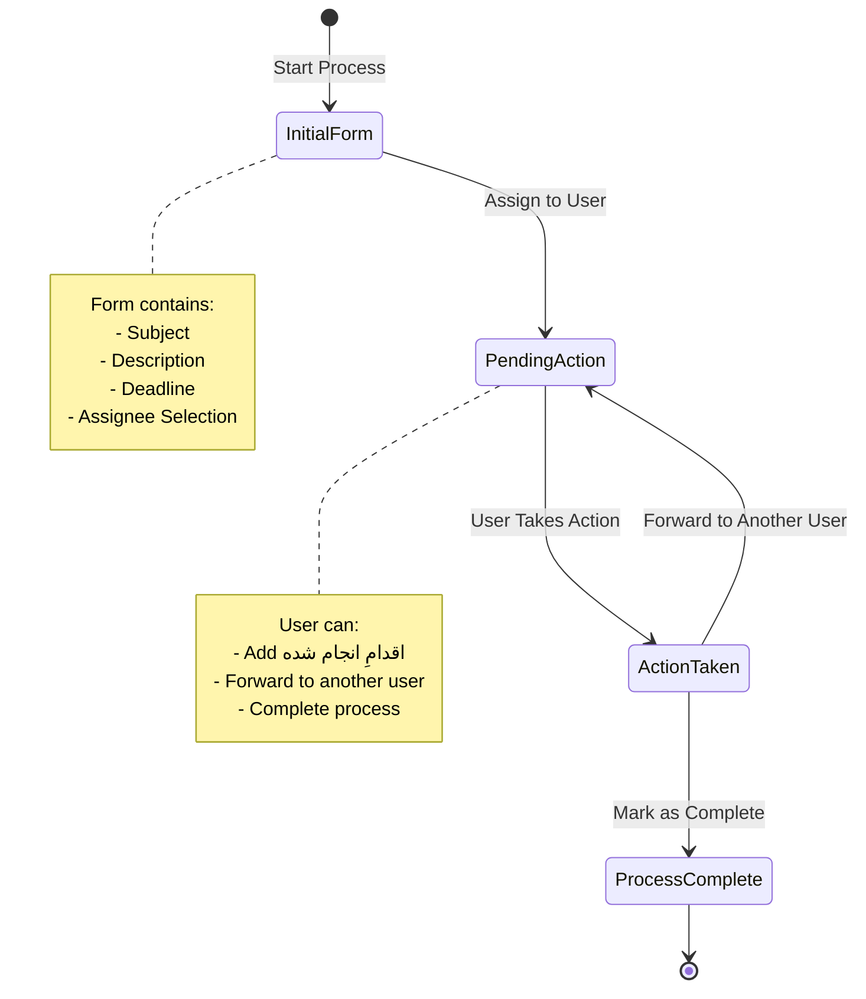

```mermaid
stateDiagram-v2
    [*] --> InitialForm: Start Process
    
    InitialForm --> PendingAction: Assign to User
    note right of InitialForm
        Form contains:
        - Subject
        - Description
        - Deadline
        - Assignee Selection
    end note
    
    PendingAction --> ActionTaken: User Takes Action
    note right of PendingAction
        User can:
        - Add اقدامِ انجام شده
        - Forward to another user
        - Complete process
    end note
    
    ActionTaken --> PendingAction: Forward to Another User
    ActionTaken --> ProcessComplete: Mark as Complete
    
    ProcessComplete --> [*]
```